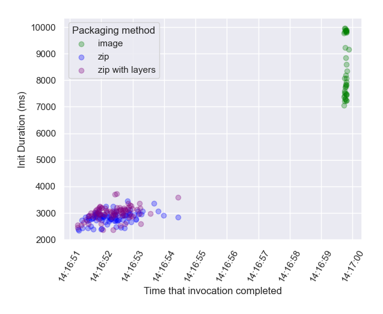
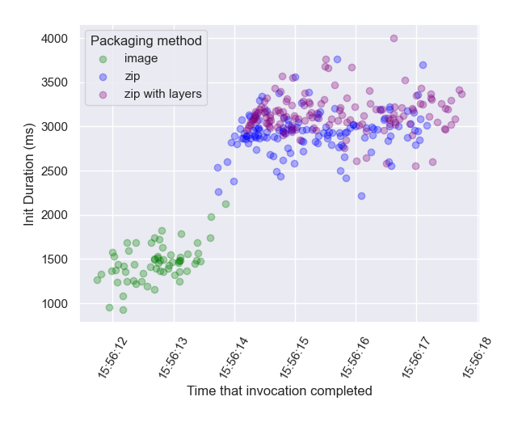
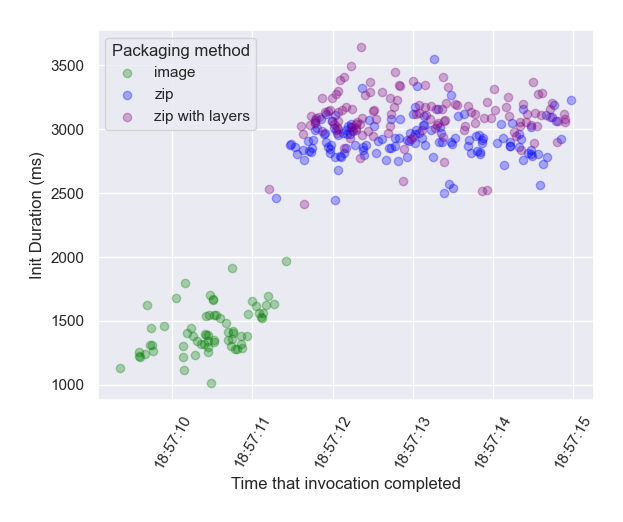
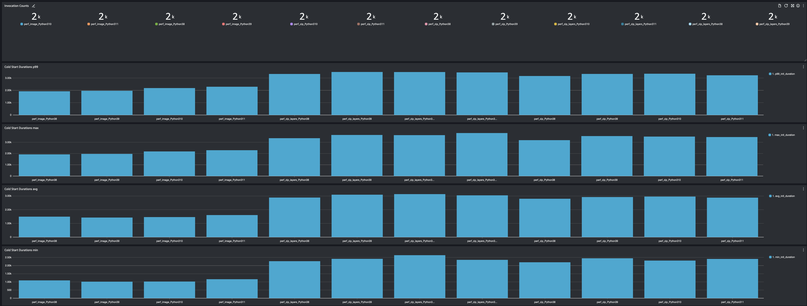
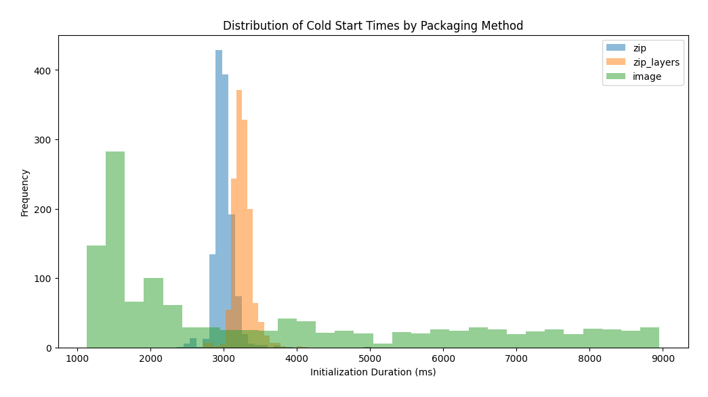

# AWS Lambda ️Python Data Science Cold Start Evaluation 🐍 ☁️ 🐢

Comparing cold starts for packaging methods and Python versions.

| | | |
|-- |-- |-- |
| | | |

See below for more information on visualising the outcome.

## Contents

- [AWS Lambda ️Python Data Science Cold Start Evaluation 🐍 ☁️ 🐢](#aws-lambda-️python-data-science-cold-start-evaluation--️-)
  - [Contents](#contents)
  - [Rationale 📖](#rationale-)
  - [Pros and Cons of packaging approaches 🧾](#pros-and-cons-of-packaging-approaches-)
  - [What this project provides 📦](#what-this-project-provides-)
  - [Installation ↗️](#installation-️)
  - [Running a test 🏃‍♀️](#running-a-test-️)
  - [Ensuring Cold Starts 🥶](#ensuring-cold-starts-)
  - [Monitoring results ⏱️](#monitoring-results-️)
  - [Explanation 🤯](#explanation-)
  - [License ⚖️](#license-️)

## Rationale 📖

Lambda ZIP packaging limits (250 MB, including all layers) presents a common challenge for Python data science workloads. Here is an example of the typical installation sizes for these modules:

|**Library** |**Size** | 
|-- |-- |
|`numpy` | 34M |
|`numpy.libs` | 34M |
|`pandas` | 61M |
|`botocore` | 82M |
|`pyarrow` | 125M |

This gives a total of 332M before any other libraries are added.

Common workarounds to this are:
1. Using container image packaging, providing a much more liberal package size of 10GB
2. Stripping non-essential parts of packages before deployment. This includes stripping debug symbols from shared libraries (`.so`), removing unit tests and documentation, and removing the `.pyc` precompiled bytecode
3. Using Lambda Layers for these dependencies. Layers still count towards the restrictive 250MB limit, but layer providers can handle the stripping and minimisation of packages so you don't have to.

Common concerns about these approaches include assumptions about the relative cold start overhead of each one. The CDK project in this repository is designed to compare this for each approach using a realistic workload.

First, what other factors might we consider before evaluating images vs. ZIP on performance alone?

## Pros and Cons of packaging approaches 🧾

|**Method** |**Pros** |**Cons** |
|-- |-- |-- |
|**ZIP** | ⬆️ Use native runtime dependency bundling |⬇️ 250MB limit |
| |⬆ AWS is responsible for maintenance and security of the runtime | ⬇️ ️ Packaging and deployment can be slower ZIP archive is not optimised for fast rebuild when a subset has changed |
| | | |
|**ZIP with Layers** |⬆️ Packaging optimisation handled by layer provider | ⬇️ 250MB limit |
| |⬆️ Deployment faster when dependencies are unchanged | ⬇️ No semantic versioning |
| |⬆ AWS is responsible for maintenance and security of the runtime  | ⬇️ Less control over dependency versions |
| | | ⬇️ Reliant on provider to continue maintenance |
| | |
|**Container Image** |⬆️ 10 GB limit | ⬇️ Runtime security and maintenance is your responsibility |
| |⬆️ Easier if you have existing container infrastructure  | ⬇️ Added complexity of container repository |
| |⬆️ Mature container ecosystem and tooling | ⬇️ _Perceived additional cold start_ ❓ Let's validate this assumption!|

## What this project provides 📦

This stack deploys a matrix of Lambda Functions with a simulated Data Science workload, including common dependencies:
 - PyArrow
 - Pandas
 - Numpy
 - AWS Lambda Powertools
 - X-Ray SDK

Three different packaging methods are evaluated:

 1. Zip packaging with `pip` package bundling
 2. Zip packaging with layers for heavy dependencies:
    1. [aws-sdk-pandas](https://aws-sdk-pandas.readthedocs.io/en/3.4.1/install.html#aws-lambda-layer) layer for `pandas`, `pyarrow`, `numpy` 
    2. [aws-lambda-powertools](https://docs.powertools.aws.dev/lambda/python/latest/#install) layer, providing Powertools for AWS Lambda (Python)
 3. Docker/OCI Container image packaging

## Installation ↗️

```bash
npm install
pip install -r requirements.txt -r requirements-dev.txt
cdk bootstrap
cdk deploy
```

## Running a test 🏃‍♀️

The stack deploys multiple Lambda functions. A script is provided to invoke functions concurrently in bulk. Invoke with:

```bash
./scripts/invoke_functions.py <NUMBER_OF_MESSAGES_PER_FUNCTION>
```

For example:
```bash
./scripts/invoke_functions.py 1000
```

## Ensuring Cold Starts 🥶

You can prevent warm starts from previous runs by running the `ensure-cold.py` script. This will update an environment variable in each function's configuration. Once you run a test, this will ensure that initial invocations of each Lambda sandbox are cold but warm starts will than start to occur again when these sandboxes are free for subsequent invocations.

```bash
./scripts/ensure-cold.py
```

## Monitoring results ⏱️
1. This stack provides a CloudWatch dashboard for monitoring execution duration, invocations and cold starts. . The dashboard can be accessed from CloudWatch by selecting `Dashboards -> LambdaDatasciPerfDashboard`.

2. A Jupyter Notebook is available to visualise the cold start distribution for different packaging methods: [cold_start_viz.ipynb](./cold_start_viz.ipynb). 🙏 Thanks to [Keelin Murphy](https://twitter.com/MurphyKeelin) for guidance in creating these plots! The plots (shown at the top of this page) illustrate:
   1. Greater cold starts for container image deployments in some (rarer) cases, usually following deployment of a new function/image
   2. Much better cold starts for container image deployments compared to ZIP-packaged functions in the majority of cases
   3. The distribution of all function cold starts for all batches of invocations over the course of a day looked like this: 

## Explanation 🤯
Why are container image function cold starts usually so much better than ZIP-packaged images? The answer is outlined in the paper, _[On-demand Container Loading in AWS Lambda (Marc Brooker, Mike Danilov, Chris Greenwood, Phil Piwonka)](https://arxiv.org/abs/2305.13162)_ describing the extensive optimisations that we avail of when using Lambda's container image deployment method. 

In brief, container image deployments use number of tiered caches that identify reused files across images, including files used in multiple customers' images! This can eliminate the need to load most of a container image's bytes from the origin (S3)!

## License ⚖️
[MIT](./LICENSE)